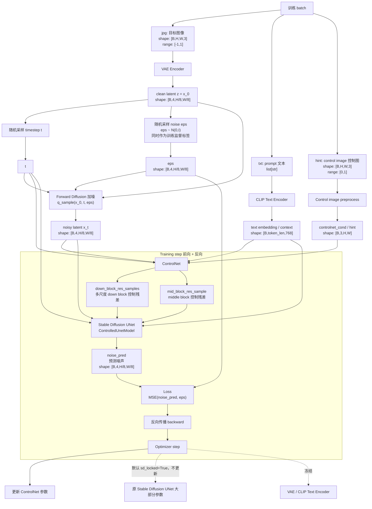
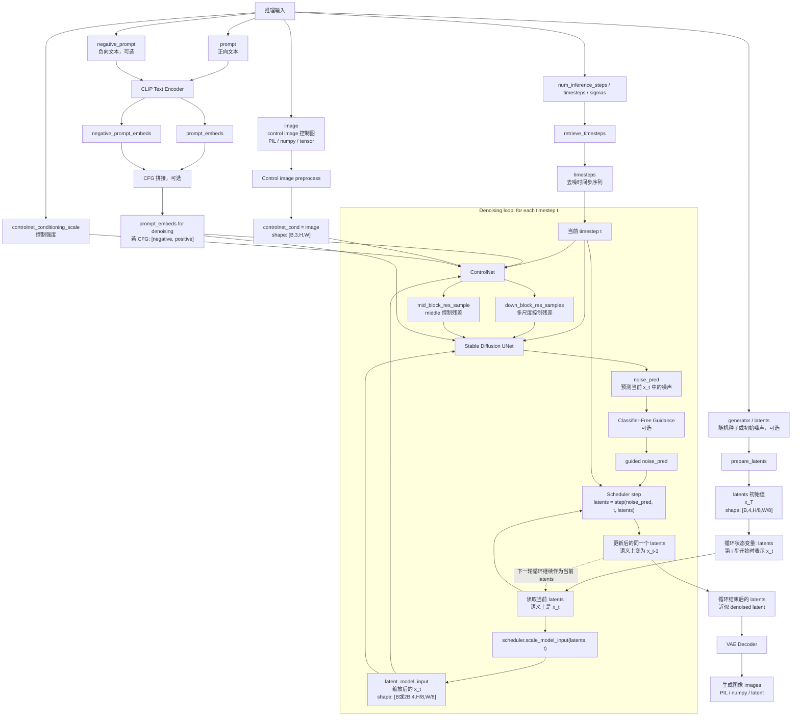

# ControlNet
## 1. 整体流程
### 1.1 训练流程

```mermaid
flowchart TD
    A["训练 batch"] --> A1["jpg: 目标图像<br/>shape: [B,H,W,3]<br/>range: [-1,1]"]
    A --> A2["txt: prompt 文本<br/>list[str]"]
    A --> A3["hint: control image 控制图<br/>shape: [B,H,W,3]<br/>range: [0,1]"]

    A1 --> B["VAE Encoder"]
    B --> B1["clean latent z = x_0<br/>shape: [B,4,H/8,W/8]"]

    A2 --> C["CLIP Text Encoder"]
    C --> C1["text embedding / context<br/>shape: [B,token_len,768]"]

    A3 --> D["Control image preprocess"]
    D --> D1["controlnet_cond / hint<br/>shape: [B,3,H,W]"]

    B1 --> E["随机采样 timestep t"]
    E --> E1["t"]

    B1 --> F["随机采样 noise eps<br/>eps ~ N(0,I)<br/>同时作为训练监督标签"]
    F --> F1["eps<br/>shape: [B,4,H/8,W/8]"]

    B1 --> G["Forward Diffusion 加噪<br/>q_sample(x_0, t, eps)"]
    E1 --> G
    F1 --> G
    G --> G1["noisy latent x_t<br/>shape: [B,4,H/8,W/8]"]

    subgraph TRAIN_STEP["Training step 前向 + 反向"]
        CN["ControlNet"]
        H1["down_block_res_samples<br/>多尺度 down block 控制残差"]
        H2["mid_block_res_sample<br/>middle block 控制残差"]

        UNET["Stable Diffusion UNet<br/>ControlledUnetModel"]
        NP["noise_pred<br/>预测噪声<br/>shape: [B,4,H/8,W/8]"]

        LOSS["Loss<br/>MSE(noise_pred, eps)"]
        BP["反向传播 backward"]
        OPT["Optimizer step"]

        CN --> H1
        CN --> H2

        H1 --> UNET
        H2 --> UNET
        UNET --> NP

        NP --> LOSS
        LOSS --> BP
        BP --> OPT
    end

    G1 --> CN
    E1 --> CN
    C1 --> CN
    D1 --> CN

    G1 --> UNET
    E1 --> UNET
    C1 --> UNET

    F1 --> LOSS

    OPT --> P1["更新 ControlNet 参数"]
    OPT -.->|默认 sd_locked=True，不更新| P2["原 Stable Diffusion UNet 大部分参数"]
    OPT -.->|冻结| P3["VAE / CLIP Text Encoder"]

```
### 1.2 推理流程

```mermaid
flowchart TD
    A["推理输入"] --> A1["prompt<br/>正向文本"]
    A --> A2["negative_prompt<br/>负向文本，可选"]
    A --> A3["image<br/>control image 控制图<br/>PIL / numpy / tensor"]
    A --> A4["generator / latents<br/>随机种子或初始噪声，可选"]
    A --> A5["controlnet_conditioning_scale<br/>控制强度"]
    A --> A6["num_inference_steps / timesteps / sigmas"]

    A1 --> B["CLIP Text Encoder"]
    A2 --> B
    B --> B1["prompt_embeds"]
    B --> B2["negative_prompt_embeds"]

    B1 --> C["CFG 拼接，可选"]
    B2 --> C
    C --> C1["prompt_embeds for denoising<br/>若 CFG: [negative, positive]"]

    A3 --> D["Control image preprocess"]
    D --> D1["controlnet_cond = image<br/>shape: [B,3,H,W]"]

    A4 --> E["prepare_latents"]
    E --> E1["latents 初始值<br/>x_T<br/>shape: [B,4,H/8,W/8]"]

    A6 --> T0["retrieve_timesteps"]
    T0 --> TLIST["timesteps<br/>去噪时间步序列"]

    E1 --> LSTATE["循环状态变量: latents<br/>第 i 步开始时表示 x_t"]

    subgraph LOOP["Denoising loop: for each timestep t"]
        T["当前 timestep t"]

        L0["读取当前 latents<br/>语义上是 x_t"]
        SMI["scheduler.scale_model_input(latents, t)"]
        LMI["latent_model_input<br/>缩放后的 x_t<br/>shape: [B或2B,4,H/8,W/8]"]

        CN["ControlNet"]
        H1["down_block_res_samples<br/>多尺度控制残差"]
        H2["mid_block_res_sample<br/>middle 控制残差"]

        UNET["Stable Diffusion UNet"]
        NP["noise_pred<br/>预测当前 x_t 中的噪声"]

        CFG["Classifier-Free Guidance<br/>可选"]
        GNP["guided noise_pred"]

        STEP["Scheduler step<br/>latents = step(noise_pred, t, latents)"]
        L1["更新后的同一个 latents<br/>语义上变为 x_t-1"]

        L0 --> SMI
        SMI --> LMI

        LMI --> CN
        T --> CN
        CN --> H1
        CN --> H2

        LMI --> UNET
        T --> UNET
        H1 --> UNET
        H2 --> UNET

        UNET --> NP
        NP --> CFG
        CFG --> GNP

        GNP --> STEP
        L0 --> STEP
        T --> STEP
        STEP --> L1
    end

    TLIST --> T
    LSTATE --> L0
    L1 -.->|下一轮循环继续作为当前 latents| L0

    C1 --> CN
    C1 --> UNET
    D1 --> CN
    A5 --> CN

    L1 --> O["循环结束后的 latents<br/>近似 denoised latent"]
    O --> P["VAE Decoder"]
    P --> Q["生成图像 images<br/>PIL / numpy / latent"]

```
